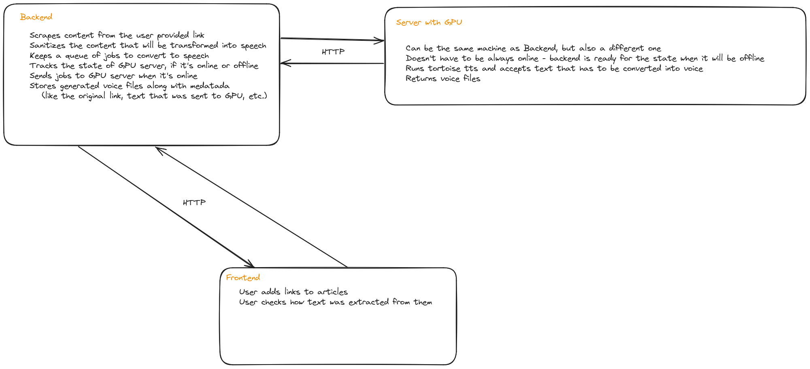

# YarnYap - convinient high qualiy articles TTS

A simple tool for automatically converting articles and Reddit threads into voice and uploading the to popular video platforms

  

## Architecture:
  - I will use tortoise tts https://github.com/neonbjb/tortoise-tts for generating voice from text
  - The application will be intended for self hosting, so it will server a single user that has a computer with GPU powerful enough to run voice generation at reasonable speed
  - User will access locally hosted website in order to put there links to articles or reddit threads to convert into speech
  - I will also create API for tortoise TTS, which can be hosted on the same server as the website, or on separate server
  - Website will download user provided websites and will extract text from them. Then it will request Tortoise TTS API for converting this text into speech
  - One of the assumptions is that the server with GPU that will be generating voice doesn't have to online all the time, so the website will have mechanism for checking if the server is available and sending text for generating only when it's online. There will be also an option to see the state of the queue and remove some items from it
  - After generating the voice it will be uploaded to youtube or/and other similar platforms, and added to some predefined playlist. User will be provided with the links by the website and maybe with some other form of notification like email

## Advantages of YarnYap over similar programs
There are some youtube channels and programs that have similar function to YarnYap, as they scrape content from reddit, convert text to speech and sometimes upload videos directly on youtube. But after analyzing them I've discovered none of those programs have all the features that are important to me, which are:
  - high quality TTS - i want to use Tortoise TTS https://github.com/neonbjb/tortoise-tts which puts emphasis on quality of the speech
  - nice UI - as I want to use this tool daily, nice UI is important for me. Most of existing solutions are just scripts which need to be run manually, and links are passed by some textfile or directly to the script, which isn't convinient
  - support for plain text articles, not only reddit threads

## Architecture

  

